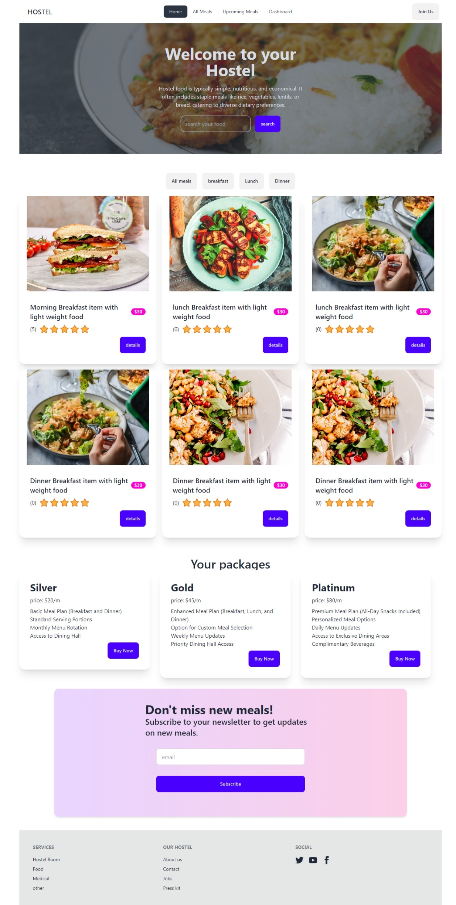

# hostel management website 
in this website a student can register and take his/her needed meal as he want and also he/she can take premium subscription. a user can get notification about upcoming meals

in this website also a admin can login and a admin can manage full website. admin can add new and upcoming meals, can manage users a admin can change user role 

# this website make with 
# react
# tailwind css
# dasiUi
# firebase 
# dotenv for environment variable

# Live website link [text](https://ssaignment12.web.app/)

# Website image:
